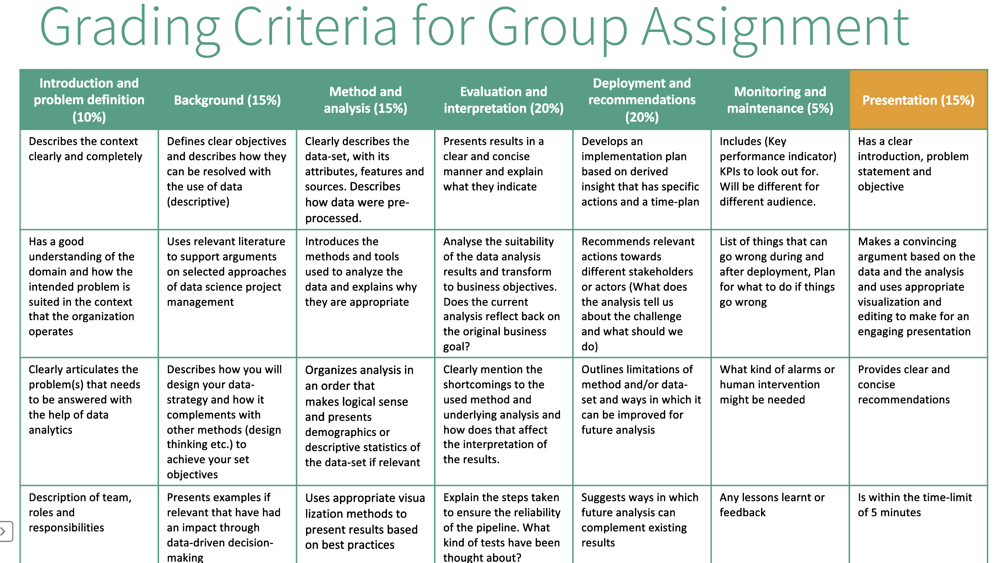

# Multimodal-Learning-Analytics (group project)

## Important links

Everything about the group assignment is [here](https://ntnu.blackboard.com/webapps/blackboard/content/listContent.jsp?course_id=_44556_1&content_id=_2161774_1) on blackboard.

The presentation can be also found [here](doc/Presentation-data-TDT4259.pdf) in doc directory.

## What questions to ask from the dataset

This is list of what could potentially be analysed on the dataset.

* Performance prediction,
* what combination of variables gives us optimal performance,
* understand underlying processes (e.g. how stress and attention work together for high-performing and low-performing students)

## Grading criteria

